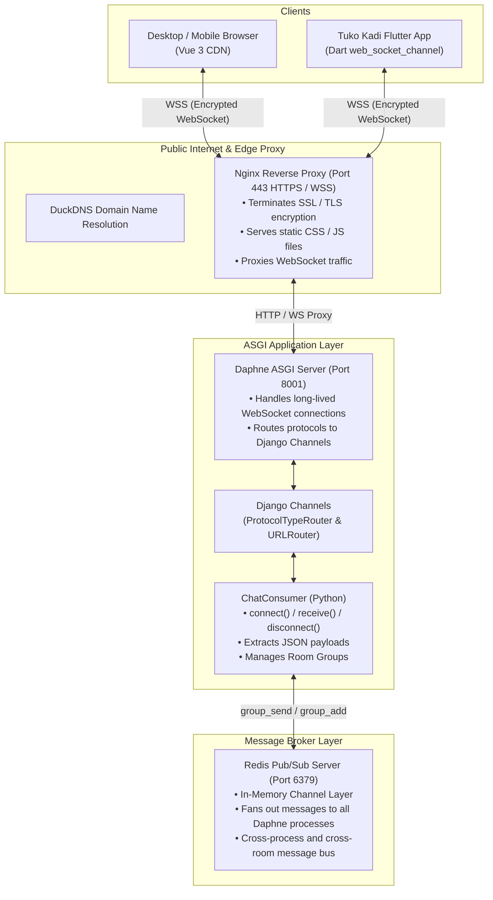

# Phase 0: Project Overview & Learning Roadmap

---

## 1. What We Just Established (Plain English Summary)

Welcome to the **Real-Time Multi-Room Chat Application** learning project! 

Before writing any code or setting up servers, we must understand **what** we are building, **why** we are building it this way, and **how** every single technology connects to the **Tuko Kadi Online Multiplayer** card game relay server.

In this introductory phase:
- We laid out the master architecture spanning frontend clients, web servers, ASGI application runners, and in-memory message brokers.
- We selected **Vue 3 via CDN** as our reactive frontend framework within Django templates—giving us modern reactive state management (`ref`, `reactive`, `v-model`, `v-for`) without any complicated Node.js build tooling.
- We established the **"Develop on Windows locally, Deploy to Oracle Cloud VM"** strategy.
- We mapped out all 11 phases that take you from an empty directory to a battle-tested, production-ready system talking to both browser and Flutter clients.

---

## 2. Why a Chat App? (The Tuko Kadi Connection)

You might wonder: *"If our ultimate goal is a multiplayer card game (Tuko Kadi), why are we building a chat app first?"*

The answer is simple: **A multiplayer card game server and a multi-room chat server are fundamentally the exact same piece of software.**

Consider what happens in both systems:
1. Multiple clients connect over a persistent, real-time connection.
2. Clients group themselves into isolated rooms (a chat room vs. a game match).
3. When one client sends data (a chat message vs. playing a card), the server broadcasts that event to every other client in that specific room.
4. If a client disconnects unexpectedly (e.g. mobile network drops), the server notifies others and handles reconnection.

By mastering the chat app first:
- You learn **Django Channels**, **WebSockets**, **Daphne**, and **Redis** with simple text messages that are easy to inspect and debug in real time.
- You avoid debugging complex card game rules (deck shuffling, card validation, turns) while trying to learn network protocols.
- Once the chat server is running and deployed, building the Tuko Kadi relay server will be familiar territory because you will reuse 90% of the exact same architecture and infrastructure.

---

## 3. End-to-End System Architecture

Here is how data flows from any client (a browser or a mobile device) through the production stack and back:



### The Data Flow Step-by-Step
1. **Connection Initiation:** The client opens `wss://yourdomain.duckdns.org/ws/chat/room101/`.
2. **TLS Termination:** Nginx receives the encrypted connection on port 443, decrypts the TLS certificate, and sees an `Upgrade: websocket` HTTP header.
3. **Internal Proxying:** Nginx forwards the raw WebSocket connection locally to Daphne listening on `127.0.0.1:8001`.
4. **Consumer Lifecycle:** Daphne hands the connection to Django Channels' ASGI router, which instantiates an instance of our `ChatConsumer`.
5. **Group Subscription:** The consumer places this connection's unique channel into the Redis group named `chat_room101`.
6. **Message Broadcasting:** When user A sends `"Hello!"`, the consumer asks Redis (`group_send`) to broadcast that message to all channels subscribed to `chat_room101`.
7. **Delivery:** Redis fans the message out to Daphne, which pushes it down the WebSocket pipes to user A, user B, and user C instantly.

---

## 4. The Technology Stack

| Technology | Role in Stack | Why We Selected It |
|---|---|---|
| **Python 3.13** | Backend Language | Readable, rich ecosystem, powers Django. |
| **Django 5.x** | Core Framework | Robust project structure, URL routing, settings management, and battle-tested security. |
| **Django Channels** | Async WebSocket Extension | Extends Django beyond traditional HTTP to handle long-lived WebSocket connections and async protocols. |
| **Daphne** | ASGI Production Web Server | Built specifically by the Django team to serve async HTTP and WebSockets simultaneously. |
| **Redis** | In-Memory Message Broker | Microsecond pub/sub messaging backend that allows multiple server processes to broadcast messages to room groups. |
| **Vue 3 (via CDN)** | Reactive Web Frontend | Reactive data binding (`ref`, `v-model`, `v-for`) directly inside Django templates with **zero build steps or Node.js overhead**. |
| **Nginx** | Reverse Proxy & SSL Gateway | Handles SSL/TLS encryption certificates (HTTPS/WSS), serves static files fast, and guards Daphne. |
| **DuckDNS + Let's Encrypt** | Free Domain & SSL | Gives our Oracle Cloud VM a public domain with a trusted SSL/TLS certificate. |
| **Flutter & Dart** | Mobile Client (Phase 10) | Connects to the same backend via `web_socket_channel`, proving cross-platform versatility. |

---

## 5. Concept Mapping Table (Chat App $\longleftrightarrow$ Tuko Kadi)

Every concept you build in this chat app has a direct 1:1 equivalent in the Tuko Kadi multiplayer game server:

| Chat App Concept | Tuko Kadi Equivalent | Detailed Explanation |
|---|---|---|
| **Room Name** (e.g. `room-lounge`) | **Game Code** (e.g. `K7M9X2`) | An isolated namespace where only connected members receive messages. |
| **User joins room** | **Player joins lobby** | WebSocket connects; user is added to the Channel Layer group via `group_add`. |
| **User sends chat message** | **Player plays card / draws** | A JSON payload is sent over the WebSocket to the server. |
| **Server broadcasts message** | **Server relays action snapshot** | The server uses `group_send` to notify everyone in the room of the event. |
| **Online user sidebar** | **Lobby roster / Table seats** | A reactive list of connected player usernames and statuses. |
| **`user_joined` / `user_left`** | **`playerJoined` / `playerLeft`** | Lifecycle notifications informing everyone who entered or disconnected. |
| **`set_username` message** | **`registerPlayer` message** | The very first handshake message identifying the client to the server. |
| **Emoji reactions** ($\text{🔥, 😂, 👏}$) | **In-game table reactions** | Ephemeral, non-persisted animated floating emojis across screens. |
| **Typing indicator** | **Turn timer / "Thinking..."** | Transient event indicating a peer is preparing an action. |
| **Room capacity limit (e.g. 8)** | **Max players limit (2–8)** | Server rejects incoming connections if the room is already full. |
| **Auto-reconnect with backoff** | **Game client auto-reconnect** | Automatically recovers when Wi-Fi drops without crashing the client app. |
| **Ping/Pong heartbeat** | **Keep-alive heartbeat** | Prevents mobile carriers and NAT routers from dropping idle connections. |
| **`ChatConsumer`** | **`GameRelayConsumer`** | The Python class that handles incoming WebSocket packets. |

---

## 6. Development Strategy: "Local Windows First, Cloud Oracle VM Second"

One of the most common stumbling blocks for beginners learning Django Channels is **Redis on Windows**.

- Redis does not natively run on Windows without WSL2 or Docker Desktop, which can add heavy configuration friction.
- **Our Strategy:**
  1. **Phases 2 through 6 (Local on Windows):** We use Django Channels' built-in `InMemoryChannelLayer`. This gives us full WebSocket and room group broadcasting in Python memory with zero third-party software installations.
  2. **Phase 7 (Production on Oracle Linux VM):** We switch `CHANNEL_LAYERS` in `settings.py` to `RedisChannelLayer`. On the Linux VM, Redis runs natively and blazingly fast as a system service.

This gives you an immediate, friction-free local development setup while keeping the code 100% ready for cloud deployment.

---

## 7. The 11-Phase Learning Roadmap

```
Phase 0  ──► Project Overview & Architecture Blueprint (You are here)
Phase 1  ──► Python, Pip & Virtual Environment Verification
Phase 2  ──► Django Project Scaffolding & File Anatomy
Phase 3  ──► WebSockets & Your First Echo Consumer
Phase 4  ──► Redis & Room Groups (Broadcasting to Multiple Tabs)
Phase 5  ──► Building the Reactive Chat Frontend (Vue 3 via CDN)
Phase 6  ──► User Presence, Online Rosters & Join/Leave Alerts
Phase 7  ──► Production Cloud Deployment (Oracle VM, Nginx, Daphne, Redis, SSL)
Phase 8  ──► Reconnection Resilience (Exponential Backoff & Heartbeats)
Phase 9  ──► Advanced Features (Floating Emoji Reactions, Capacity Limits, Typing Indicators)
Phase 10 ──► Connecting from Flutter (Cross-Platform Dart WebSocket Client)
Phase 11 ──► Master Review & Transition to Tuko Kadi Relay Server
```

---

## 8. Key Concepts Explained for Beginners

### What is HTTP vs. WebSocket?
- **HTTP (HyperText Transfer Protocol):** A *half-duplex, request-and-response* protocol. The client asks for a page, the server responds, and the connection closes immediately. The server *cannot* initiate a message to the client on its own.
- **WebSocket:** A *full-duplex, persistent bidirectional pipe*. After an initial HTTP handshake, the connection stays open indefinitely. Either the client or the server can push a message down the pipe at any microsecond.

### What is WSGI vs. ASGI?
- **WSGI (Web Server Gateway Interface):** Python's traditional standard for synchronous web apps (standard Django, Flask). It handles one request per thread and closes. It is incapable of holding open thousands of idle WebSocket connections.
- **ASGI (Asynchronous Server Gateway Interface):** The modern async standard for Python. It allows Python to handle long-lived asynchronous connections (WebSockets, HTTP long-polling, Server-Sent Events) concurrently using Python's `asyncio` event loop.

### What is a Channel Layer?
Django Channels provides an abstraction called a **Channel Layer**:
- **Channel:** Think of it like a private mailbox or phone number belonging to exactly one connected WebSocket client.
- **Group:** A named contact list (e.g. `"chat_room1"`). When you send a message to a group, the Channel Layer copies that message into the mailbox of every channel currently in that group.

### Why Vue 3 via CDN?
Instead of installing Node.js, `npm`, Vite, and building static bundles:
- We load Vue directly from a script tag in our HTML: `<script src="https://unpkg.com/vue@3/dist/vue.global.js"></script>`.
- We use the modern **Composition API** (`ref`, `computed`, `onMounted`).
- Our UI becomes instantly reactive: whenever a WebSocket event arrives, we simply push it to our Vue array, and Vue re-renders the DOM in milliseconds.

---

## 9. Common Beginner Pitfalls & Tips

1. **Confusing ws:// and wss://**:
   - `ws://` is unencrypted WebSocket (used on `localhost` during local development).
   - `wss://` is encrypted WebSocket over TLS/SSL (mandatory in production and required by mobile apps like Flutter).
2. **Forgetting to activate the virtual environment**:
   - Always verify your shell shows `(venv)` before running `python manage.py` or installing packages.
3. **Mixing up WSGI and ASGI**:
   - Running `python manage.py runserver` with Daphne installed automatically runs in ASGI mode. If Daphne is missing from `INSTALLED_APPS`, Django falls back to standard WSGI and WebSockets will fail with a 404 or 400 error.

---

## 10. Glossary

- **ASGI:** Asynchronous Server Gateway Interface.
- **WSGI:** Web Server Gateway Interface.
- **WebSocket:** A persistent, bidirectional communication channel over a single TCP connection.
- **Consumer:** The Channels equivalent of a Django View, handling WebSocket events (`connect`, `receive`, `disconnect`).
- **Pub/Sub:** Publish/Subscribe messaging model where senders (publishers) push messages to topics without knowing who the receivers (subscribers) are.
- **Reverse Proxy:** A server (like Nginx) that sits in front of backend servers to forward client requests, terminate SSL, and balance load.
- **TLS/SSL:** Transport Layer Security, encrypting traffic between client and server.
- **Composition API:** Vue 3's function-based API for handling reactive state and component logic.
