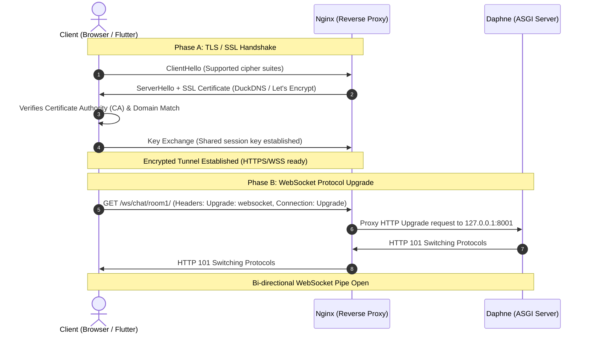

# Phase 1: Python & Tools Setup

---

## 1. What We Just Verified (Plain English Summary)

Before we start building our Django Channels server, we must ensure our development foundation is solid. In this phase, we inspected your local development machine and confirmed:
- **Python 3.13.7** is installed and accessible directly from your terminal.
- **pip 25.2** (Python’s package manager) is ready to install third-party libraries.
- The environment is prepped to create isolated virtual environments so your global system Python remains completely clean.

---

## 2. Key Concepts Explained for Beginners

### What is Python?
Python is the backend programming language our chat server is written in. It is high-level, human-readable, and supported by one of the largest web and networking software ecosystems in the world (including Django and Django Channels).

### What is pip?
`pip` stands for *"Pip Installs Packages"*. It is Python’s official package manager.
- If you come from **Flutter / Dart**, `pip` is the direct equivalent of `dart pub` or `flutter pub`.
- When you want to add a library (like `django` or `channels`), you tell `pip` to download and install it from the central Python package repository (PyPI).

### What is a Virtual Environment (`venv`)?
A virtual environment is a self-contained, isolated directory that holds a specific copy of Python plus any third-party packages needed for a specific project.
- **Why use it?** If Project A needs Django 4.2 and Project B needs Django 5.1, installing packages globally into Windows would cause version conflicts. A virtual environment gives each project its own private "sandbox".
- When you activate a `venv`, running `pip install` places packages inside that local folder (`venv/Lib/site-packages`) rather than into your Windows `C:\Python313\` directory.

### Comparing Python (`pip` / `venv`) to Dart (`pub` / `pubspec.yaml`)

| Feature | Python | Flutter / Dart |
|---|---|---|
| **Package Manager** | `pip` | `flutter pub` / `dart pub` |
| **Dependency Manifest** | `requirements.txt` | `pubspec.yaml` |
| **Package Repository** | PyPI (`pypi.org`) | pub.dev (`pub.dev`) |
| **Isolation Mechanism** | `venv` directory inside project | Global cache (`.pub-cache`) with project-level lockfile |
| **Activation Step** | Must activate (`venv\Scripts\activate`) | Handled automatically per project |

---

## 3. How SSL and WSS Work (Secure WebSockets)

In Phase 0, we noted that clients connect via `ws://` locally and `wss://` in production. Let’s understand what that means.

- **`ws://`** = Unencrypted WebSocket over standard TCP (Port 80).
- **`wss://`** = WebSocket running inside a **TLS/SSL encrypted tunnel** (Port 443).



### Why Mobile Apps (Android & iOS) Require WSS and Reject Plain WS
Modern mobile operating systems enforce strict network security policies:
1. **Cleartext Traffic Blocking:** By default, Android (Network Security Config) and iOS (App Transport Security / ATS) reject unencrypted `http://` and `ws://` requests across the public internet.
2. **Cellular Carrier Interference:** Cellular network proxies frequently inspect and kill unencrypted HTTP port 80 connections that remain open for long periods. Because `wss://` on port 443 is end-to-end encrypted, intermediate carrier equipment cannot tamper with or terminate the WebSocket connection.
3. **Flutter Compatibility:** In Phase 10, when our Flutter app connects to our cloud relay, iOS and Android will connect smoothly without needing security bypass exceptions because we use a valid Let's Encrypt SSL certificate.

---

## 4. Environment & Prerequisites Checklist

Here is our readiness status across local and cloud environments:

### Local Machine (Windows)
- [x] **Python 3.10+ Installed:** Python 3.13.7 verified on PATH.
- [x] **pip Installed:** pip 25.2 verified.
- [x] **Virtual Environment Tooling:** Built-in `venv` module ready.

### Cloud Infrastructure (Oracle Cloud VM)
*(These will be used in Phase 7 during production deployment; they are documented in your infrastructure guides)*
- [ ] Oracle Cloud VM provisioned (Ubuntu / ARM64 Ampere or x86)
- [ ] DuckDNS subdomain created and updating VM public IP
- [ ] Ports 80 and 443 open in Oracle Cloud VCN Security List & `iptables`
- [ ] Let's Encrypt SSL certificate obtained via Certbot

---

## 5. Common Mistakes & Windows Debugging Tips

### 1. PowerShell Script Execution Policy (`PSSecurityException`)
On Windows, when you run `venv\Scripts\activate`, PowerShell may give an error like:
```text
File ...\activate.ps1 cannot be loaded because running scripts is disabled on this system.
```
**Fix:** Open PowerShell as Administrator (or in user scope) and run:
```powershell
Set-ExecutionPolicy -ExecutionPolicy RemoteSigned -Scope CurrentUser
```
Alternatively, you can activate via CMD or Git Bash:
- In Command Prompt: `venv\Scripts\activate.bat`
- In Git Bash: `source venv/Scripts/activate`

### 2. Using Global Python by Mistake
If you run `pip install` without activating the virtual environment first, libraries install globally into `C:\Python313\`.
**Always check:** Look for `(venv)` at the beginning of your terminal prompt before running `pip` or `python`.

---

## 6. Glossary

- **`pip`**: Package installer for Python.
- **`venv`**: Python’s standard library module for creating isolated virtual environments.
- **`requirements.txt`**: A plain text file listing all pip packages and versions needed to recreate the environment.
- **TLS / SSL**: Transport Layer Security (formerly Secure Sockets Layer), providing data encryption, integrity, and authentication over networks.
- **WSS**: WebSocket Secure (`wss://`), WebSocket traffic encrypted using TLS over port 443.
- **Let's Encrypt**: A free, automated, and open Certificate Authority (CA) providing trusted SSL certificates.
