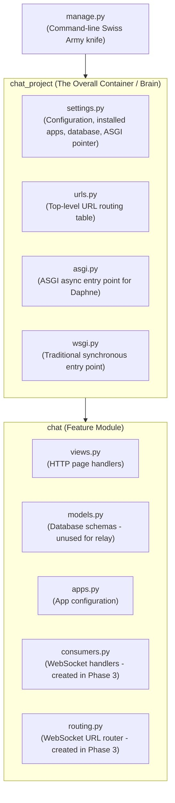

# Phase 2: Django Project Scaffolding

---

## 1. What We Just Built (Plain English Summary)

In Phase 2, we took our first practical step in building the backend:
1. **Isolated Virtual Environment (`venv`):** Created a dedicated sandbox holding our Python interpreter and libraries, completely separated from Windows' system Python.
2. **Core Dependencies Installed:** Installed `django` (web framework), `channels` (WebSocket & async event engine), and `daphne` (ASGI server).
3. **Dependency Manifest (`requirements.txt`):** Captured exact package versions so this environment can be identically reproduced on your Oracle Cloud VM.
4. **Scaffolded Django Project & App:** Generated the root project directory (`chat_project`) and the modular feature app (`chat`).
5. **Configured Settings for ASGI:** Registered `daphne` at the very top of `INSTALLED_APPS`, registered `channels` and `chat`, and added `ASGI_APPLICATION = 'chat_project.asgi.application'`.
6. **Project Hygiene (`.gitignore`):** Ensured virtual environments, compiled bytecode, and local SQLite database files will never pollute git.
7. **System Health Verification:** Executed `python manage.py check`, which passed with **0 issues**.

---

## 2. Commands Executed and What Each Did (In Order)

Here is the exact sequence of commands and operations carried out in this phase, along with a detailed explanation of what each one did:

### Step 1: Create `.gitignore`
*Before installing anything*, we created `.gitignore` in the project root.
- **Why first?** It guarantees that Git immediately ignores `venv/`, Python bytecode caches (`__pycache__/`), and local database files (`db.sqlite3`) from the very first second they are created.

### Step 2: Create the Virtual Environment
```powershell
python -m venv venv
```
- `python`: Calls your system's Python 3.13 executable.
- `-m venv`: Tells Python to run its built-in `venv` standard library module.
- `venv`: The name of the target directory to create.
- **What it did:** Created an isolated Python environment inside `CHAT_APP/venv/` with its own `python.exe`, `pip.exe`, and a private `Lib/site-packages` directory.

### Step 3: Install Core Libraries
```powershell
.\venv\Scripts\python.exe -m pip install django channels daphne
```
- `.\venv\Scripts\python.exe`: Explicitly invokes the Python binary inside our new virtual environment (preventing any accidental installation into Windows global Python).
- `-m pip install`: Runs `pip` to download and install packages from PyPI.
- `django channels daphne`:
  - `django`: Installs Django 6.1.1 (the core web framework).
  - `channels`: Installs Django Channels 4.3.2 (adds ASGI and WebSocket channel layer abstractions).
  - `daphne`: Installs Daphne 4.2.3 (the ASGI HTTP and WebSocket web server).
- **What it did:** Downloaded and installed all 3 packages plus their underlying networking and cryptography dependencies (`Twisted`, `autobahn`, `cryptography`, `asgiref`, etc.) into `venv/Lib/site-packages`.

### Step 4: Freeze Installed Dependencies to `requirements.txt`
```powershell
.\venv\Scripts\python.exe -m pip freeze > requirements.txt
```
- `pip freeze`: Inspects the active virtual environment and outputs every installed package along with its exact version (e.g. `Django==6.1.1`).
- `> requirements.txt`: Redirects that output into a text file.
- **What it did:** Created a portable dependency manifest so the exact same environment can be reproduced on the Oracle Linux server in Phase 7 using `pip install -r requirements.txt`.

### Step 5: Initialize the Django Project
```powershell
.\venv\Scripts\python.exe -m django startproject chat_project .
```
- `-m django startproject`: Executes Django’s project generator.
- `chat_project`: The name of the central project directory containing configuration files (`settings.py`, `urls.py`, `asgi.py`, `wsgi.py`).
- `.` (the dot): Tells Django to create `manage.py` and `chat_project/` right inside the **current folder**, rather than wrapping everything inside a redundant duplicate outer folder (`CHAT_APP/chat_project/chat_project/`).
- **What it did:** Generated `manage.py` and the `chat_project/` configuration directory.

### Step 6: Create the Chat App Feature Module
```powershell
.\venv\Scripts\python.exe manage.py startapp chat
```
- `manage.py startapp`: Django’s command to generate a new application module.
- `chat`: The name of our chat application.
- **What it did:** Created the `chat/` directory with boilerplate files (`models.py`, `views.py`, `apps.py`, `admin.py`, `migrations/`).

### Step 7: Configure ASGI Settings in `settings.py`
We edited `chat_project/settings.py` to:
1. Place `'daphne'` as the **very first item** in `INSTALLED_APPS` (so Daphne takes over `runserver` in ASGI mode).
2. Add `'channels'` and `'chat'` to `INSTALLED_APPS`.
3. Add `ASGI_APPLICATION = 'chat_project.asgi.application'`.

### Step 8: System Configuration Validation
```powershell
.\venv\Scripts\python.exe manage.py check
```
- `manage.py check`: Django’s internal system checker. It parses all installed apps, settings, and URL confs without starting a live web server.
- **What it did:** Validated that the Django project, Daphne, and Channels are correctly configured, returning `System check identified no issues (0 silenced)`.

### Step 9: Verify Git Status and Exclusions
```powershell
git status
```
- `git status`: Checks the Git working tree.
- **What it did:** Confirmed that `venv/` and `__pycache__/` are properly ignored by Git, leaving only legitimate source files ready for commit.

---

## 3. Project Architecture: Project vs. App

In Django, there is a fundamental distinction between a **Project** and an **App**:



- **`chat_project` (The Project):** The administrative container. It manages global settings, database connections, middleware, ASGI/WSGI entry points, and root URL routing. A project can contain multiple apps.
- **`chat` (The App):** A self-contained, modular package that does one specific job (in our case, chat and WebSocket room relaying). In a larger Django system, you might have separate apps for `accounts`, `billing`, and `chat`.

---

## 4. Every File Explained in Detail

### Root Files

#### `manage.py`
The command-line interface for your Django project. You never edit this file directly. You use it to run commands like:
- `python manage.py runserver` (boots local dev server)
- `python manage.py check` (verifies config)
- `python manage.py startapp <name>` (generates a new app module)
- `python manage.py collectstatic` (gathers static files for production)

#### `requirements.txt`
A list of all 26 packages installed in your virtual environment (including sub-dependencies like `Twisted`, `autobahn`, `cryptography`, and `asgiref`). It allows running `pip install -r requirements.txt` on any machine (such as your Oracle VM) to replicate the environment instantly.

#### `.gitignore`
Tells Git which files to ignore. Critical entries:
- `venv/`: Never commit virtual environments (they are machine-specific and huge).
- `__pycache__/` and `*.pyc`: Compiled Python bytecode.
- `db.sqlite3`: Local development database (should not overwrite production database).

---

### Project Configuration (`chat_project/`)

#### `chat_project/settings.py`
The central nervous system of your project. Key settings:
- **`BASE_DIR`**: The filesystem path to the project root, calculated dynamically using `Path(__file__).resolve().parent.parent`.
- **`SECRET_KEY`**: A cryptographic salt used by Django for signing sessions and CSRF tokens. *(In production, this is kept secret; for our local learning project, Django's default is fine).*
- **`DEBUG = True`**: Displays detailed error stack traces in the browser. Must be set to `False` in production (Phase 7).
- **`ALLOWED_HOSTS = []`**: Host/domain names that this Django site can serve. Empty in local dev (`localhost` is allowed by default), but will contain your DuckDNS domain in production.
- **`INSTALLED_APPS`**: The list of active modules. 
  ```python
  INSTALLED_APPS = [
      'daphne',       # MUST BE FIRST! Enables ASGI runserver
      'chat',         # Our chat application
      'channels',     # Django Channels async engine
      'django.contrib.admin',
      'django.contrib.auth',
      ...
  ]
  ```
  > **Why does `daphne` need to be at the very top?**
  > When you run `python manage.py runserver`, Django looks through `INSTALLED_APPS` in order. If `daphne` is first, it overrides Django's built-in standard HTTP `runserver` command with Daphne's ASGI-enabled `runserver`, which can handle both HTTP and WebSockets simultaneously.
- **`ASGI_APPLICATION = 'chat_project.asgi.application'`**: Tells Daphne and Channels where to find the async protocol router.
- **`ROOT_URLCONF = 'chat_project.urls'`**: Points to the main URL routing table.
- **`DATABASES`**: Configured by default to SQLite (`db.sqlite3`).
- **`STATIC_URL = 'static/'`**: Base URL for serving static CSS and JavaScript files.

#### `chat_project/urls.py`
The master URL routing table (like a route table in Flutter). Maps incoming HTTP URL paths (like `/admin/` or `/chat/`) to view functions.

#### `chat_project/asgi.py`
The **Asynchronous Server Gateway Interface** entry point. When Daphne runs your project in production, it imports `application` from this file. In Phase 3, we will upgrade this file with `ProtocolTypeRouter` to route WebSocket traffic to our consumer.

#### `chat_project/wsgi.py`
The legacy synchronous entry point (Web Server Gateway Interface). We will not use WSGI because it cannot handle WebSockets.

---

### App Module (`chat/`)

- **`chat/apps.py`**: Declares metadata for the `chat` application.
- **`chat/views.py`**: Where HTTP request handlers live (we will write views here in Phase 5 to render the Vue chat UI).
- **`chat/models.py`**: Where database models are defined. *(For our in-memory real-time relay, we don't store chat logs in a database, keeping it ultra-fast just like Tuko Kadi).*
- **`chat/admin.py`**: Configures the Django Admin dashboard.

---

## 5. How This Maps to Tuko Kadi

| Chat Project Component | Tuko Kadi Server Equivalent | Note |
|---|---|---|
| `chat_project/` | `tuko_server/` | The root project configuration on the Oracle VM. |
| `chat/` | `game_relay/` | The app module handling game traffic. |
| `daphne` first in `INSTALLED_APPS` | Same | Daphne powers both servers. |
| `ASGI_APPLICATION` | Same | Routes WebSocket connections to the game engine consumer. |
| `manage.py` | Same | Used to test and manage both backends. |

---

## 6. Verification: What We Checked

We ran:
```powershell
.\venv\Scripts\python.exe manage.py check
```
**Result:**
```text
System check identified no issues (0 silenced).
```
This confirms that:
- Python syntax across all settings and app files is valid.
- `daphne` and `channels` are loaded correctly.
- Django’s internal registry recognizes `chat` as an installed application.

---

## 7. Common Mistakes & Debugging Tips

1. **Placing `daphne` below `django.contrib.staticfiles`:**
   - **Error:** `runserver` starts in traditional WSGI mode instead of ASGI. WebSockets will fail with HTTP 404 or connection refused.
   - **Fix:** Keep `'daphne'` as line 1 in `INSTALLED_APPS`.
2. **Forgetting `ASGI_APPLICATION`:**
   - **Error:** Daphne starts but crashes when attempting to route WebSocket requests because it doesn't know where the ASGI application lives.
   - **Fix:** Ensure `ASGI_APPLICATION = 'chat_project.asgi.application'` is present in `settings.py`.
3. **Accidentally committing `venv/`:**
   - Always ensure `.gitignore` contains `venv/` before running `git add .`.

---

## 8. Glossary

- **Django**: A high-level Python web framework encouraging rapid development and clean design.
- **MVT (Model-View-Template)**: Django's software pattern (Model = data, View = business logic, Template = UI).
- **`INSTALLED_APPS`**: A tuple/list in `settings.py` informing Django which features and third-party libraries are active.
- **Daphne**: An ASGI server written in Python, maintained by the Django project, designed to handle WebSockets and HTTP/2.
- **`manage.py check`**: A built-in validation command that scans installed models, settings, and configs for common errors without running the server.
