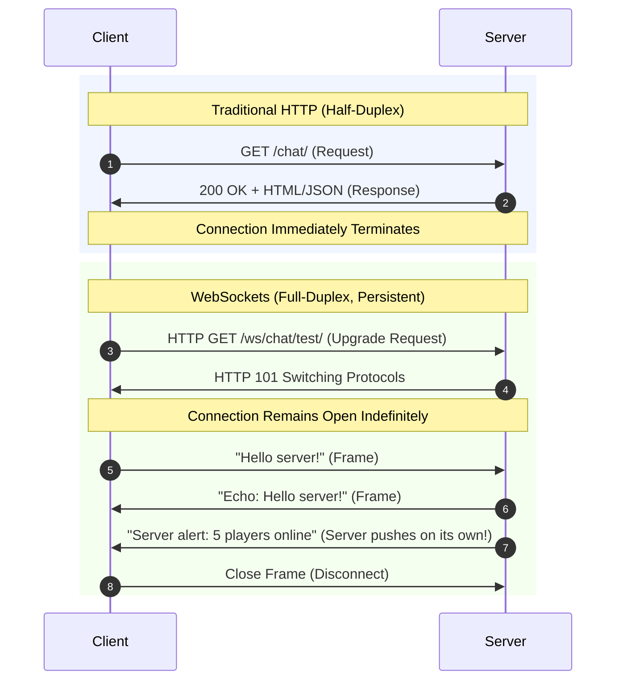

# Phase 3: WebSockets & Your First Consumer

---

## 1. What We Just Built (Plain English Summary)

In Phase 3, we transitioned our application from a traditional static web server into a **real-time bidirectional event engine**:
1. **Created Your First WebSocket Consumer (`ChatConsumer`):** Written in `chat/consumers.py`. It accepts incoming WebSocket connections, sends an initial greeting, catches incoming messages, safely parses JSON, and echoes them back.
2. **Defined WebSocket URL Routing (`chat/routing.py`):** Configured Django Channels to route the endpoint `ws/chat/test/` directly to our consumer.
3. **Upgraded the ASGI Root Router (`chat_project/asgi.py`):** Replaced Django's default synchronous handler with a `ProtocolTypeRouter`. Incoming traffic is now split: standard HTTP goes to Django views, while WebSocket traffic (`ws://`) is routed to Channels consumers.
4. **Configured the Local Channel Layer:** Added `CHANNEL_LAYERS` in `settings.py` configured with `InMemoryChannelLayer` (and added production-ready Redis settings commented out for Phase 7).
5. **Built & Executed Automated Tests (`chat/tests.py`):** Verified the entire consumer lifecycle (`connect` $\rightarrow$ `welcome` $\rightarrow$ `send` $\rightarrow$ `echo` $\rightarrow$ `disconnect`) using Channels' `WebsocketCommunicator`. The test ran and passed in **0.006s**.

---

## 2. Commands Executed and What Each Did (In Order)

Here is the exact sequence of commands and operations carried out in this phase, along with what each one did:

### Step 1: Create `chat/consumers.py`
We created the `ChatConsumer` class extending `AsyncWebsocketConsumer`.
- **What it did:** Implemented the async methods `connect()`, `receive()`, and `disconnect()`, handling connection acceptance, incoming JSON message processing, and outgoing echo transmissions.

### Step 2: Create `chat/routing.py`
We created `websocket_urlpatterns` mapping the URL regex `^ws/chat/test/$` to `ChatConsumer.as_asgi()`.
- **What it did:** Defined the WebSocket routing table, functioning like `urls.py` but exclusively for WebSocket connections.

### Step 3: Update `chat_project/asgi.py`
We updated `asgi.py` to wrap `django_asgi_app` and `chat.routing.websocket_urlpatterns` inside `ProtocolTypeRouter` and `AuthMiddlewareStack`.
- **What it did:** Told Daphne how to inspect incoming connections by protocol type (`http` vs `websocket`).

### Step 4: Configure `CHANNEL_LAYERS` in `chat_project/settings.py`
We appended the `CHANNEL_LAYERS` dictionary with `InMemoryChannelLayer`.
- **What it did:** Configured Django Channels' inter-process messaging backend so consumers can communicate and broadcast.

### Step 5: Validate Configuration Health
```powershell
.\venv\Scripts\python.exe manage.py check
```
- **What it did:** Scanned the updated settings, ASGI router, and URL confs. Confirmed **0 issues**.

### Step 6: Create & Execute Automated WebSocket Unit Test
```powershell
.\venv\Scripts\python.exe manage.py test
```
- `manage.py test`: Spins up an in-memory test runner, creates a temporary test database, executes test cases in `chat/tests.py`, and reports results.
- **What it did:** Programmatically established a WebSocket connection to `ws/chat/test/`, verified the initial welcome payload, sent a test message, asserted that the echo response was received, and cleanly disconnected.
- **Result:** `Ran 1 test in 0.006s — OK`.

---

## 3. Key Concepts Explained for Beginners

### HTTP vs. WebSocket: Side-by-Side Comparison



- **HTTP:** Like sending postal letters. You send a letter, wait for a reply letter, and the interaction is finished. If the server has new information 5 seconds later, it cannot notify you—you must send another letter (polling).
- **WebSocket:** Like a live telephone phone call. Once the call is connected, both sides can speak simultaneously at any microsecond.

### The WebSocket Upgrade Handshake
A WebSocket connection does not start as a raw TCP socket—it starts as a standard HTTP request with special headers:
```http
GET /ws/chat/test/ HTTP/1.1
Host: 127.0.0.1:8000
Upgrade: websocket
Connection: Upgrade
Sec-WebSocket-Key: dGhlIHNhbXBsZSBub25jZQ==
Sec-WebSocket-Version: 13
```
If the server supports WebSockets (which Daphne and Channels do), it replies with:
```http
HTTP/1.1 101 Switching Protocols
Upgrade: websocket
Connection: Upgrade
```
From this exact moment onward, the connection is no longer HTTP—it is a continuous, lightweight binary/text WebSocket stream.

### What is a Consumer? (Views vs. Consumers)

| Aspect | Django View (`views.py`) | Channels Consumer (`consumers.py`) |
|---|---|---|
| **Protocol** | HTTP | WebSocket / ASGI |
| **Lifecycle** | Short-lived (milliseconds) | Long-lived (minutes, hours, days) |
| **Trigger** | Single request $\rightarrow$ response | Stream of events (`connect`, `receive`, `disconnect`) |
| **Server Push** | Impossible | Built-in via `self.send()` |
| **Instance Scope** | Created and destroyed per request | One instance exists for the entire duration of the connection |

### The Consumer Lifecycle
Every `AsyncWebsocketConsumer` has 3 primary lifecycle hooks:
1. **`connect(self)`**: Invoked during the HTTP 101 upgrade. Calling `await self.accept()` accepts the connection. If authentication fails, calling `await self.close()` rejects it.
2. **`receive(self, text_data=None, bytes_data=None)`**: Invoked every time the client sends data across the pipe.
3. **`disconnect(self, close_code)`**: Invoked when the client closes the connection, switches networks, or closes the tab.

---

## 4. Line-by-Line Code Breakdown

### 1. `chat/consumers.py`
```python
import json
from channels.generic.websocket import AsyncWebsocketConsumer

class ChatConsumer(AsyncWebsocketConsumer):
    async def connect(self):
        # 1. Accept the incoming handshake
        await self.accept()

        # 2. Push an immediate welcome confirmation down the socket
        await self.send(text_data=json.dumps({
            'type': 'connection_established',
            'message': 'Connected to Django Channels Echo Server!'
        }))

    async def disconnect(self, close_code):
        # Triggered when client disconnects (close_code e.g. 1000 = clean close)
        pass

    async def receive(self, text_data=None, bytes_data=None):
        # Parse payload safely
        try:
            data = json.loads(text_data)
            message = data.get('message', '')
        except (json.JSONDecodeError, TypeError):
            message = text_data or ''

        # Send response back to THIS specific client
        await self.send(text_data=json.dumps({
            'type': 'echo_response',
            'message': f'Echo from server: {message}'
        }))
```
- **`AsyncWebsocketConsumer`**: Base class utilizing Python's `async`/`await` event loop for non-blocking I/O.
- **`await self.accept()`**: Handshakes with the client. Without this, the connection hangs and eventually times out.
- **`await self.send(text_data=...)`**: Pushes a text frame directly to the connected client.
- **`try/except json.JSONDecodeError`**: Essential resilience. If a client sends malformed data or raw text, the server must not crash—it catches the error and handles it gracefully.

---

### 2. `chat/routing.py`
```python
from django.urls import re_path
from . import consumers

websocket_urlpatterns = [
    re_path(r'^ws/chat/test/$', consumers.ChatConsumer.as_asgi()),
]
```
- **`websocket_urlpatterns`**: List of URL patterns specifically for WebSockets.
- **`r'^ws/chat/test/$'`**: Regular expression matching incoming WebSocket paths. By convention, WebSocket URLs begin with `ws/` to distinguish them from standard HTTP views.
- **`consumers.ChatConsumer.as_asgi()`**: Converts the consumer class into an ASGI-compliant callable application.

---

### 3. `chat_project/asgi.py`
```python
import os
from django.core.asgi import get_asgi_application

os.environ.setdefault('DJANGO_SETTINGS_MODULE', 'chat_project.settings')

# Populate Django app registry first
django_asgi_app = get_asgi_application()

from channels.routing import ProtocolTypeRouter, URLRouter
from channels.auth import AuthMiddlewareStack
import chat.routing

application = ProtocolTypeRouter({
    "http": django_asgi_app,
    "websocket": AuthMiddlewareStack(
        URLRouter(
            chat.routing.websocket_urlpatterns
        )
    ),
})
```
- **`ProtocolTypeRouter`**: The top-level router that inspects the connection type:
  - If `http` $\rightarrow$ sends to standard Django (`django_asgi_app`).
  - If `websocket` $\rightarrow$ sends to `URLRouter`.
- **`AuthMiddlewareStack`**: Populates the connection with user session data (`self.scope['user']`), identical to Django's standard request authentication.
- **`URLRouter`**: Matches the requested WebSocket path against `chat.routing.websocket_urlpatterns`.

---

### 4. `chat_project/settings.py` (Channel Layer)
```python
CHANNEL_LAYERS = {
    "default": {
        "BACKEND": "channels.layers.InMemoryChannelLayer",
    },
}
```
- **`InMemoryChannelLayer`**: Stores channel mailboxes in local RAM. Requires zero external processes or Redis installations, making local development on Windows completely friction-free.

---

## 5. How to Test Live in Your Browser Console

You can test this live right now without writing any frontend code!

### Step 1: Start the Development Server
In your PowerShell terminal:
```powershell
.\venv\Scripts\python.exe manage.py runserver
```
You will see Daphne boot up:
```text
Django version 6.1.1, using settings 'chat_project.settings'
Starting ASGI/Daphne version 4.2.3 development server at http://127.0.0.1:8000/
Quit the server with CTRL-BREAK.
```

### Step 2: Open Browser Console
1. Open your browser (Chrome, Edge, or Firefox).
2. Visit any webpage (even `http://127.0.0.1:8000` or `about:blank`).
3. Press **F12** (or right-click $\rightarrow$ **Inspect**) and click the **Console** tab.

### Step 3: Run This JavaScript Snippet
Copy and paste this into the Console and press **Enter**:
```javascript
const ws = new WebSocket('ws://127.0.0.1:8000/ws/chat/test/');

ws.onopen = () => {
    console.log('%c Connected to WebSocket!', 'color: green; font-weight: bold;');
    ws.send(JSON.stringify({ message: 'Hello from browser console!' }));
};

ws.onmessage = (event) => {
    console.log('%c Received from server:', 'color: blue; font-weight: bold;', JSON.parse(event.data));
};

ws.onclose = () => {
    console.log('%c Connection closed.', 'color: red; font-weight: bold;');
};
```

### Expected Output in Console:
```text
Connected to WebSocket!
Received from server: {type: 'connection_established', message: 'Connected to Django Channels Echo Server!'}
Received from server: {type: 'echo_response', message: 'Echo from server: Hello from browser console!'}
```

---

## 6. How This Maps to Tuko Kadi

| Echo Chat Concept | Tuko Kadi Equivalent |
|---|---|
| `ChatConsumer` | `GameRelayConsumer` |
| `connect()` $\rightarrow$ `accept()` | Player connects $\rightarrow$ server admits player to relay socket |
| `receive()` $\rightarrow$ parse message | Server receives `cardPlayed` or `drawCard` packet |
| `self.send()` | Direct response to the active player (e.g. invalid move warning) |
| `routing.py` | Routes `ws/game/<room_code>/` to the game consumer |
| `WebsocketCommunicator` test | Automated testing of player turn packets |

---

## 7. Common Mistakes & Debugging Tips

1. **`WebSocket connection to 'ws://...' failed: Error during WebSocket handshake: Unexpected response code: 404`**
   - **Cause:** URL mismatch in `routing.py` or missing trailing slash.
   - **Fix:** Ensure the URL in JavaScript (`ws://127.0.0.1:8000/ws/chat/test/`) exactly matches the regex in `chat/routing.py` (including the trailing slash).
2. **`django.core.exceptions.AppRegistryNotReady: Apps aren't loaded yet.`**
   - **Cause:** Importing models or routing before calling `django.core.asgi.get_asgi_application()`.
   - **Fix:** In `chat_project/asgi.py`, always call `django_asgi_app = get_asgi_application()` *before* importing `chat.routing`.
3. **Closing Tab without handling disconnect:**
   - In our consumer, `disconnect()` receives a `close_code`. In Phase 4 & 6, we will use this hook to remove the player from the room group and announce their departure to other players.

---

## 8. Glossary

- **WebSocket Handshake:** The initial HTTP `Upgrade` request that converts an HTTP connection into a full-duplex WebSocket connection.
- **Full-Duplex:** Bidirectional data transmission where both parties can transmit data simultaneously.
- **Consumer:** Django Channels' abstraction for handling long-lived protocol connections.
- **`AsyncWebsocketConsumer`**: An asynchronous consumer class providing non-blocking WebSocket handlers.
- **`ProtocolTypeRouter`**: Channels ASGI router that inspects the connection protocol (`http` or `websocket`) and directs it to the appropriate sub-application.
- **`WebsocketCommunicator`**: Channels' built-in test client for programmatically connecting to and testing WebSocket consumers.
