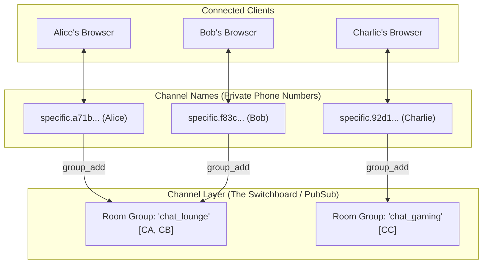

# Phase 4: Redis & Room Groups (Broadcasting)

---

## 1. What We Just Built (Plain English Summary)

In Phase 3, our server operated as an **Echo Server** (a 1-to-1 reflection where messages were only returned to the person who sent them).

In Phase 4, we upgraded our server into a **Multi-Room Group Broadcasting Engine**:
1. **Dynamic Room Names:** Users can now join any arbitrary room by specifying it in the WebSocket URL (e.g., `ws/chat/lounge/`, `ws/chat/room101/`).
2. **Channel Layer Groups:** When a user connects, their unique WebSocket connection (`channel_name`) is subscribed to a named group (e.g. `chat_lounge`).
3. **1-to-Many Fan-Out:** When Alice sends a message, Django Channels broadcasts that message to the group. **Alice, Bob, and every other user currently connected to that room receive it simultaneously.**
4. **Cross-Room Isolation:** Messages sent in room `general` never bleed into room `gaming`. Each room is an isolated channel group.
5. **Automated Multi-Client Testing:** Built an automated test in `chat/tests.py` verifying that two clients in the same room receive each other's messages, while a third client in another room receives nothing. Passed in **0.109s**.

---

## 2. Commands Executed and What Each Did (In Order)

Here is the exact sequence of commands and operations carried out in this phase:

### Step 1: Update `chat/consumers.py`
We updated `ChatConsumer` to:
- Extract `self.room_name` dynamically from `self.scope['url_route']['kwargs']['room_name']`.
- Call `await self.channel_layer.group_add(self.room_group_name, self.channel_name)` on connection.
- Call `await self.channel_layer.group_discard(self.room_group_name, self.channel_name)` on disconnect.
- Call `await self.channel_layer.group_send()` in `receive()` to broadcast messages.
- Implement the `chat_message(self, event)` event handler to push broadcasts down to the individual WebSocket client.

### Step 2: Update `chat/routing.py`
We replaced the static `ws/chat/test/` URL pattern with a dynamic regular expression:
`r'^ws/chat/(?P<room_name>\w+)/$'`.
- **What it did:** Allows any alphanumeric room name to be routed to `ChatConsumer`.

### Step 3: Write Multi-Client Automated Tests in `chat/tests.py`
We created `RoomGroupTests.test_room_group_broadcasting_and_isolation()` simulating 3 concurrent clients across 2 distinct rooms.
- **What it did:** Programmatically proved that group broadcasting works and cross-room isolation is strictly enforced.

### Step 4: Execute Automated Unit Tests
```powershell
.\venv\Scripts\python.exe manage.py test
```
- **What it did:** Ran the new multi-client test suite.
- **Result:** `Ran 1 test in 0.109s — OK`.

### Step 5: System Configuration Validation
```powershell
.\venv\Scripts\python.exe manage.py check
```
- **What it did:** Verified that settings, consumers, and dynamic URL routes have zero syntax or configuration issues.
- **Result:** `System check identified no issues (0 silenced)`.

---

## 3. Key Concepts Explained for Beginners

### Channels vs. Groups vs. The Channel Layer

To understand how real-time broadcasting works in Django Channels, visualize a **telephone system**:



1. **A Channel (`self.channel_name`):**
   - Every single WebSocket connection receives a unique, random string identifier assigned by Channels (e.g. `specific.a71b...`).
   - Think of this as the user's **private phone number**. Only that one specific client listens on that channel.
2. **A Group (`self.room_group_name`):**
   - A named collection of channels (e.g. `chat_lounge`).
   - Think of this as a **group chat** or **conference call**.
   - Channels can join (`group_add`) or leave (`group_discard`) at any time.
3. **The Channel Layer:**
   - The transport mechanism / switchboard that routes messages between different channels and groups.

---

### The Three Essential Group Operations

```python
# 1. Join a group
await self.channel_layer.group_add(group_name, self.channel_name)

# 2. Broadcast to everyone in the group
await self.channel_layer.group_send(group_name, event_dictionary)

# 3. Leave the group
await self.channel_layer.group_discard(group_name, self.channel_name)
```

### How `group_send` Routes to Event Handlers
Notice a subtle but critical Django Channels convention:
When you broadcast with `group_send`:
```python
await self.channel_layer.group_send(
    self.room_group_name,
    {
        'type': 'chat_message',  # <--- MAGIC HAPPENS HERE
        'message': 'Hello!',
        'sender': 'Alice'
    }
)
```
Django Channels takes the string in `'type'` (`'chat_message'`), converts dots to underscores, and automatically calls the method with that name on every consumer in the group:
```python
async def chat_message(self, event):
    # This method is automatically called for every member of the group!
    await self.send(text_data=json.dumps(...))
```
If you sent `'type': 'player_turn'`, Channels would look for `async def player_turn(self, event)`.

---

### What is Redis and Why Do We Need It in Production?

In local development, we use `InMemoryChannelLayer`:
- It stores groups in Python's local RAM.
- **The limitation:** In production, a single CPU core cannot handle thousands of players. You run multiple Daphne worker processes (e.g., Worker 1, Worker 2, Worker 3).
- **The problem with In-Memory:** If Alice is connected to Worker 1 and Bob is connected to Worker 2, Worker 1 has no access to Worker 2's RAM! Alice’s message would never reach Bob.
- **The Redis solution:** **Redis** is an ultra-fast in-memory database that runs outside of Python. All Daphne workers connect to Redis on port `6379`. When Alice sends a message, Worker 1 publishes it to Redis, and Redis instantly fans it out to Worker 2, Worker 3, and all connected clients.

| Feature | `InMemoryChannelLayer` (Local) | `RedisChannelLayer` (Production) |
|---|---|---|
| **Software Required** | None (Built into Channels) | Redis server (`redis-server`) |
| **Operating System** | Works anywhere (Windows, macOS, Linux) | Native to Linux (requires Docker/WSL on Windows) |
| **Multi-Process Support** | ❌ Single process only | ✅ Multiple Daphne workers & servers |
| **Speed** | Nanoseconds | Microseconds (< 1ms) |
| **Where we use it** | Phases 2–6 on your Windows PC | Phase 7+ on your Oracle Linux VM |

---

## 4. Line-by-Line Code Breakdown

### `chat/consumers.py`
```python
import json
from channels.generic.websocket import AsyncWebsocketConsumer

class ChatConsumer(AsyncWebsocketConsumer):
    async def connect(self):
        # 1. Grab room name from URL kwargs (e.g. ws/chat/lounge/ -> 'lounge')
        self.room_name = self.scope['url_route']['kwargs']['room_name']
        
        # 2. Prefix group name to avoid naming collisions
        self.room_group_name = f'chat_{self.room_name}'

        # 3. Add this connection's channel to the room group
        await self.channel_layer.group_add(
            self.room_group_name,
            self.channel_name
        )

        # 4. Accept the handshake
        await self.accept()

        # 5. Notify THIS connecting client that they joined
        await self.send(text_data=json.dumps({
            'type': 'connection_established',
            'room': self.room_name,
            'message': f'Connected to room: {self.room_name}'
        }))

    async def disconnect(self, close_code):
        # 6. Remove channel from group when user leaves
        await self.channel_layer.group_discard(
            self.room_group_name,
            self.channel_name
        )

    async def receive(self, text_data=None, bytes_data=None):
        # 7. Safe JSON parsing
        try:
            data = json.loads(text_data)
            message = data.get('message', '')
            sender = data.get('sender', 'Anonymous')
        except (json.JSONDecodeError, TypeError):
            message = text_data or ''
            sender = 'Anonymous'

        # 8. Broadcast to the entire room group
        await self.channel_layer.group_send(
            self.room_group_name,
            {
                'type': 'chat_message',
                'message': message,
                'sender': sender
            }
        )

    async def chat_message(self, event):
        # 9. Triggered when the group sends 'chat_message'
        message = event['message']
        sender = event.get('sender', 'Anonymous')

        # 10. Send the message payload down this specific client's socket
        await self.send(text_data=json.dumps({
            'type': 'chat_message',
            'message': message,
            'sender': sender
        }))
```

- **`self.scope`**: The Channels equivalent of Django's `request`. It contains information about the connection: HTTP headers, client IP, authenticated user, and parsed URL parameters (`self.scope['url_route']['kwargs']`).
- **`self.channel_name`**: Automatically generated by Channels when the consumer is instantiated.
- **`self.channel_layer.group_add()`**: Asynchronously registers `self.channel_name` in the group. Must be awaited!
- **`self.channel_layer.group_discard()`**: Prevents memory leaks by ensuring closed sockets don't linger in Redis/Memory groups.

---

### `chat/routing.py`
```python
from django.urls import re_path
from . import consumers

websocket_urlpatterns = [
    re_path(r'^ws/chat/(?P<room_name>\w+)/$', consumers.ChatConsumer.as_asgi()),
]
```
- **`(?P<room_name>\w+)`**: Named capture group in Python regex. Matches any word characters (letters, numbers, underscores) and passes it as a keyword argument `room_name` into `self.scope['url_route']['kwargs']['room_name']`.

---

## 5. How to Test Multi-Tab Broadcasting in Your Browser

Now you can test real-time broadcasting across multiple browser tabs!

### Step 1: Start the Development Server
In your PowerShell terminal:
```powershell
.\venv\Scripts\python.exe manage.py runserver
```

### Step 2: Open Two Browser Tabs Side by Side
1. Open **Google Chrome**.
2. Open **Tab 1** and open Developer Tools (**F12** $\rightarrow$ **Console**).
3. Open **Tab 2** (or a duplicate window) and open Developer Tools (**F12** $\rightarrow$ **Console**).

### Step 3: Connect Both Tabs to the Same Room (`general`)
Paste this code in **Tab 1** (Alice):
```javascript
const wsAlice = new WebSocket('ws://127.0.0.1:8000/ws/chat/general/');
wsAlice.onopen = () => console.log('%c Alice Connected!', 'color: green; font-weight: bold;');
wsAlice.onmessage = (e) => console.log('%c Alice Received:', 'color: blue; font-weight: bold;', JSON.parse(e.data));
```

Paste this code in **Tab 2** (Bob):
```javascript
const wsBob = new WebSocket('ws://127.0.0.1:8000/ws/chat/general/');
wsBob.onopen = () => console.log('%c Bob Connected!', 'color: green; font-weight: bold;');
wsBob.onmessage = (e) => console.log('%c Bob Received:', 'color: blue; font-weight: bold;', JSON.parse(e.data));
```

### Step 4: Send a Message from Tab 1
In **Tab 1** (Alice), run:
```javascript
wsAlice.send(JSON.stringify({ sender: 'Alice', message: 'Hello from Tab 1!' }));
```

### What You Will See:
- **Tab 1 (Alice):** Receives `{type: 'chat_message', sender: 'Alice', message: 'Hello from Tab 1!'}`.
- **Tab 2 (Bob):** **Simultaneously receives the exact same message without refreshing!**

### Step 5: Test Room Isolation
Open a **Tab 3** (Charlie) connected to a different room:
```javascript
const wsCharlie = new WebSocket('ws://127.0.0.1:8000/ws/chat/gaming/');
wsCharlie.onmessage = (e) => console.log('Charlie received:', e.data);
```
Send another message from Tab 1 (`general`). **Tab 3 receives nothing!**

---

## 6. How This Maps to Tuko Kadi

| Multi-Room Chat Concept | Tuko Kadi Server Equivalent | Note |
|---|---|---|
| `ws/chat/<room_name>/` | `ws/game/<game_code>/` | Dynamically routes to game lobby (e.g. `K7M9X2`). |
| `group_name = f'chat_{room}'` | `group_name = f'game_{code}'` | Groups all players seated at that specific card table. |
| `group_add(group, channel)` | Player joins game lobby | Player is added to match broadcast group. |
| `group_send('chat_message')` | `group_send('game_action')` | Host broadcasts card play / turn update to all players. |
| `group_discard(group, channel)` | Player quits / disconnects | Player removed from table roster. |
| Cross-room isolation | Match isolation | Players in Game A never receive cards played in Game B. |

---

## 7. Common Mistakes & Debugging Tips

1. **Forgetting `await` on channel layer operations:**
   - **Error:** `RuntimeWarning: coroutine 'group_add' was never awaited`.
   - **Fix:** `group_add`, `group_send`, and `group_discard` are async coroutines. Always prepend them with `await`.
2. **Special characters in room names:**
   - Redis and Channels channel groups only allow ASCII alphanumerics, hyphens, and underscores (max 100 characters).
   - Our regex `(?P<room_name>\w+)` protects against this by only matching `[a-zA-Z0-9_]`.
3. **Group event type naming convention:**
   - In `group_send({'type': 'some_name', ...})`, the type must correspond to a method on the consumer: `async def some_name(self, event)`. Dots (`chat.message`) are automatically converted to underscores (`chat_message`).

---

## 8. Glossary

- **Pub/Sub (Publish/Subscribe):** A messaging pattern where message senders (publishers) push messages to a topic/group, and all subscribers receive the message automatically.
- **Fan-Out:** The process of taking one message and duplicating it to multiple recipients.
- **Channel Layer:** Django Channels' inter-process and inter-connection communication bridge.
- **Redis:** A lightning-fast in-memory data store used as a message broker in production.
- **`InMemoryChannelLayer`**: Built-in channel layer storing group data in local process RAM for development.
