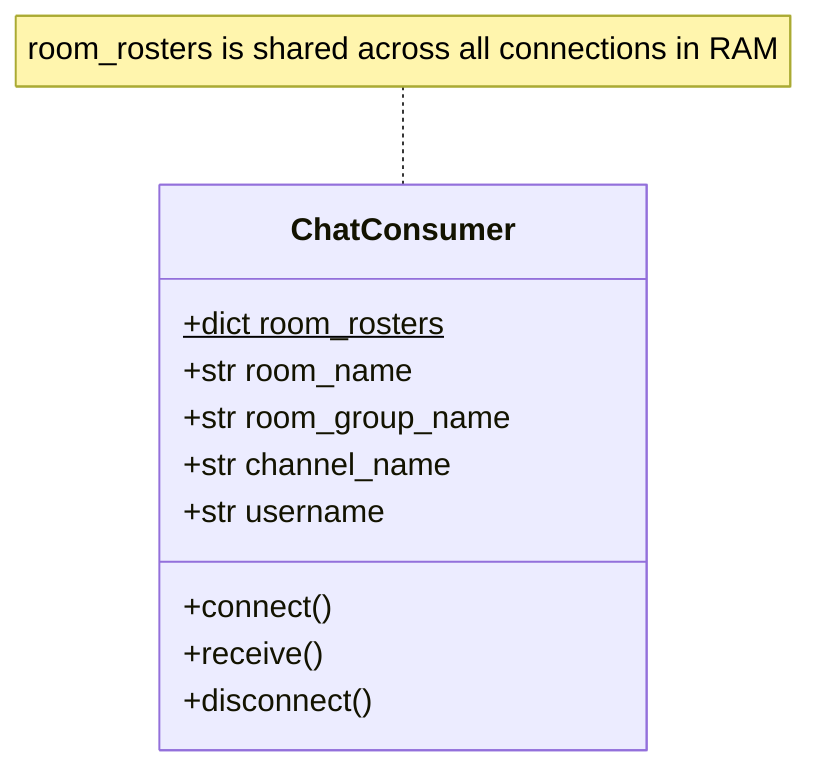

# Phase 6: User Presence & Notifications

---

## 1. What We Just Built (Plain English Summary)

In Phase 5, users could send messages to one another, but the server had no awareness of **who** was currently online in any room.

In Phase 6, we implemented **real-time user presence tracking and notifications**:
1. **Typed Message Protocol:** The consumer now inspects the `type` field of every incoming JSON packet (`set_username`, `chat_message`).
2. **First-Message Handshake (`set_username`):** As soon as the browser establishes a WebSocket connection, it sends an initial registration payload identifying the user handle.
3. **Room Presence Roster:** The server tracks active users in each room using a dictionary mapping `{ channel_name: username }`. This correctly handles multi-tab users without duplicate counts or premature leaves.
4. **Join & Leave Announcements:**
   - When a user joins $\rightarrow$ broadcasts `user_joined` to everyone in the room with an updated user list.
   - When a user closes their tab or loses internet $\rightarrow$ `disconnect()` removes them and broadcasts `user_left`.
5. **Initial State Synchronization:** The newly connected user immediately receives a private `user_list` payload so their sidebar displays everyone already in the room.
6. **Vue 3 Presence UI:** Added an **Online Users Sidebar** with a live participant count badge (`Online (3)`), active user chips with pulsating green status dots, and a highlighted `(You)` tag for the current client.
7. **In-Stream System Notifications:** Subtle, centered pills in the chat stream: *"👋 Alice joined the room"* (green) and *"🚪 Bob left the room"* (amber).
8. **Automated Unit Tests (`chat/tests.py`):** Verified the full presence lifecycle (register $\rightarrow$ sync list $\rightarrow$ join broadcast $\rightarrow$ chat $\rightarrow$ disconnect broadcast $\rightarrow$ cross-room isolation) in **0.136s**.

---

## 2. Commands Executed and What Each Did (In Order)

Here is the exact sequence of commands and operations carried out in this phase:

### Step 1: Update `chat/consumers.py`
We updated `ChatConsumer` to:
- Maintain a class-level dictionary `room_rosters = {}` mapping `{ room_group_name: { channel_name: username } }`.
- Parse incoming `type` fields in `receive()`: handling `set_username` (register user & sync roster) and `chat_message` (broadcast text).
- Update `disconnect()` to clean up the channel, compute remaining unique users, and broadcast `user_left` if the user has no remaining open tabs.
- Implement group event handlers: `user_joined(self, event)` and `user_left(self, event)`.

### Step 2: Update `chat/static/chat/style.css`
We added CSS classes for the sidebar layout (`.chat-sidebar`, `.sidebar-header`, `.count-badge`, `.user-list`, `.user-item`, `.badge-you`) and distinctive styling for arrival and departure pills (`.message-system.user-join`, `.message-system.user-leave`).

### Step 3: Update `chat/templates/chat/room.html`
We integrated:
- Immediate handshake transmission: `socket.send(JSON.stringify({ type: 'set_username', username: username.value }))` on `onopen`.
- Vue 3 state management: reactive `onlineUsers` array and handling for `user_list`, `user_joined`, and `user_left`.
- Responsive sidebar template displaying active users with count badge.

### Step 4: Update Automated Unit Tests in `chat/tests.py`
We implemented `UserPresenceAndBroadcastingTests` simulating multi-user registrations, list sync assertions, join alerts, and disconnect triggers.

### Step 5: Run Automated Unit Tests
```powershell
.\venv\Scripts\python.exe manage.py test
```
- **What it did:** Executed all 3 test suites.
- **Result:** `Ran 3 tests in 0.136s — OK`.

### Step 6: Validate System Health
```powershell
.\venv\Scripts\python.exe manage.py check
```
- **What it did:** Validated that settings, consumers, views, and routing have zero configuration issues.
- **Result:** `System check identified no issues (0 silenced)`.

---

## 3. Key Concepts Explained for Beginners

### 1. The Typed Message Protocol Pattern

Earlier, our server assumed every incoming packet was a chat message. In production real-time applications (and multiplayer games), WebSockets carry many different kinds of events over a single pipe.

We structure every packet with a top-level **`type`** field:
```json
// Registration handshake
{ "type": "set_username", "username": "Brian" }

// Chat message
{ "type": "chat_message", "message": "Good morning!", "sender": "Brian" }

// System broadcast: user joined
{ "type": "user_joined", "username": "Alice", "users": ["Brian", "Alice"] }

// System broadcast: user left
{ "type": "user_left", "username": "Alice", "users": ["Brian"] }
```

In `consumers.py`, our `receive()` function acts as a dispatcher:
```python
msg_type = data.get('type')
if msg_type == 'set_username':
    # Handle user registration
elif msg_type == 'chat_message':
    # Handle chat broadcast
```
This is the **exact same pattern** that Tuko Kadi uses to route `playCard`, `drawCard`, `declareNikoKadi`, and `gameStateSnapshot`!

---

### 2. State Management in Async Consumers: Instance vs. Class Variables

In Django Channels, an instance of `ChatConsumer` is created **per connection**:
- **Instance Variables (`self.username`, `self.room_name`, `self.channel_name`):**
  Belong to that specific WebSocket connection. When that tab closes, this instance is destroyed.
- **Class Variables (`ChatConsumer.room_rosters`):**
  Defined on the class itself (`room_rosters = {}`). They are shared across **all** consumer instances within that Python process.



> **Why `{ channel_name: username }` mapping?**
> If user "Brian" opens two browser tabs, he has **two separate channel names** (`channel_1`, `channel_2`).
> If we simply stored a set of usernames (`{"Brian"}`), closing Tab 1 would remove "Brian" from the entire room even though Tab 2 is still actively chatting!
> By mapping each channel to its username, closing Tab 1 only removes `channel_1`. Since `channel_2` is still in the dictionary, the server knows Brian is still online and does not broadcast a false `user_left` alert.

---

### 3. `self.send()` vs. `self.channel_layer.group_send()`

Understanding the distinction between these two methods is vital:
- **`self.send()` (Unicast / Private Message):**
  Sends a message **only to this one specific client**. 
  *Used for:* Sending the initial `user_list` to the newly joined player upon connecting (no need to spam existing users with the full list).
- **`self.channel_layer.group_send()` (Multicast / Broadcast):**
  Pushes an event into Redis/Memory to be distributed to **all channels subscribed to that room group**.
  *Used for:* Announcing `user_joined`, `user_left`, and `chat_message`.

---

### 4. Resilient Disconnect Handling
Network disconnections are unpredictable:
- A user might click the "Leave" button cleanly.
- Or their phone might enter a tunnel, lose cellular signal, run out of battery, or the browser might crash.

Regardless of *how* the connection breaks, the TCP socket terminates. Daphne detects the broken TCP socket and automatically triggers the consumer's `disconnect()` method. This guarantees our cleanup code will execute and the user will never become a "ghost" stuck in the room.

---

## 4. Line-by-Line Code Breakdown

### `chat/consumers.py`
```python
class ChatConsumer(AsyncWebsocketConsumer):
    # Class-level dictionary shared by all consumer instances in process RAM
    room_rosters = {}

    async def connect(self):
        self.room_name = self.scope['url_route']['kwargs']['room_name']
        self.room_group_name = f'chat_{self.room_name}'
        self.username = None

        await self.channel_layer.group_add(self.room_group_name, self.channel_name)
        await self.accept()

    async def disconnect(self, close_code):
        # 1. Cleanly unsubscribe from the channel layer group
        await self.channel_layer.group_discard(self.room_group_name, self.channel_name)

        # 2. Look up this channel in our room roster
        if self.room_group_name in ChatConsumer.room_rosters:
            roster = ChatConsumer.room_rosters[self.room_group_name]
            departed_user = roster.pop(self.channel_name, self.username)

            # Prune room if completely empty
            if not roster:
                ChatConsumer.room_rosters.pop(self.room_group_name, None)
                distinct_users = []
            else:
                distinct_users = sorted(list(set(roster.values())))

            # If user has no remaining channels in this room, announce their departure
            if departed_user and departed_user not in distinct_users:
                await self.channel_layer.group_send(
                    self.room_group_name,
                    {
                        'type': 'user_left',
                        'username': departed_user,
                        'users': distinct_users
                    }
                )

    async def receive(self, text_data=None, bytes_data=None):
        data = json.loads(text_data)
        msg_type = data.get('type')

        if msg_type == 'set_username':
            self.username = data.get('username', 'Anonymous').strip() or 'Anonymous'

            if self.room_group_name not in ChatConsumer.room_rosters:
                ChatConsumer.room_rosters[self.room_group_name] = {}
            ChatConsumer.room_rosters[self.room_group_name][self.channel_name] = self.username

            distinct_users = sorted(list(set(ChatConsumer.room_rosters[self.room_group_name].values())))

            # Private sync to newcomer
            await self.send(text_data=json.dumps({
                'type': 'user_list',
                'users': distinct_users
            }))

            # Broadcast join announcement to all room members
            await self.channel_layer.group_send(
                self.room_group_name,
                {
                    'type': 'user_joined',
                    'username': self.username,
                    'users': distinct_users
                }
            )
```

---

## 5. How to Test User Presence Live in Your Browser

### Step 1: Run the Development Server
In your PowerShell terminal:
```powershell
.\venv\Scripts\python.exe manage.py runserver
```

### Step 2: Open Tab 1 (Alice)
1. Open Google Chrome to `http://127.0.0.1:8000/`.
2. Enter username `Alice` and room `general`. Click **Join Room**.
3. Notice:
   - Alice's sidebar shows **Online Users (1)** with **Alice (You)**.

### Step 3: Open Tab 2 (Bob)
1. Open an Incognito window (or second tab) to `http://127.0.0.1:8000/`.
2. Enter username `Bob` and room `general`. Click **Join Room**.
3. **Watch what happens on both screens simultaneously:**
   - **Alice's screen:** Instantly sees *"👋 Bob joined the room"* appear in the chat stream, and Bob appears in Alice's sidebar under **Online Users (2)**!
   - **Bob's screen:** Bob's sidebar instantly shows **Alice** and **Bob (You)**!

### Step 4: Test Disconnect
1. Close Bob's tab.
2. Look at Alice's screen:
   - Instantly sees *"🚪 Bob left the room"*.
   - Bob disappears from Alice's sidebar, and the badge updates to **Online Users (1)**.

---

## 6. How This Maps to Tuko Kadi

| Chat Presence Feature | Tuko Kadi Game Equivalent | Purpose |
|---|---|---|
| `set_username` handshake | `registerPlayer` payload | Associates socket channel with player name and user ID. |
| `user_joined` event | `playerJoined` lobby event | Shows new player avatar sitting at the card table. |
| `user_left` event | `playerDisconnected` event | Pauses turn timer, shows "Reconnecting..." over player's seat. |
| Online Users Sidebar | Lobby Player Roster (2–8 players) | Displays players seated, avatars, and "Ready" checkmarks. |
| Initial `user_list` sync | Initial `LobbySnapshot` sync | Informs new player who is already at the table before they arrived. |

---

## 7. Common Mistakes & Debugging Tips

1. **Duplicate users in the roster:**
   - Always calculate unique users using `sorted(list(set(roster.values())))`.
2. **Ghosts in the roster:**
   - If `disconnect()` fails to clean up, users remain in the roster forever. Ensure the cleanup code is inside `disconnect()` and handles edge cases where `self.room_group_name` might not have been set yet (e.g. if rejected during handshake).
3. **Class variable limitations in production:**
   - `ChatConsumer.room_rosters` lives in memory within a single Python process. In Phase 7 when deploying to production with Redis across multiple workers, we can store room rosters in Redis hashes or query channel layer presence so all worker processes share the same roster.

---

## 8. Glossary

- **Presence:** The ability of a networked application to track and display the online/offline connection state of users in real time.
- **Unicast:** Transmitting a message to exactly one recipient.
- **Multicast / Broadcast:** Transmitting a message to a group of recipients.
- **Handshake Payload:** A protocol packet sent immediately after connection establishment to identify and authenticate the client.
- **Roster:** A list of active participants in a specific room or match.
